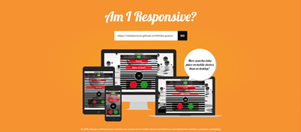
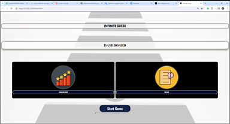
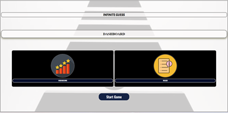
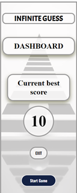
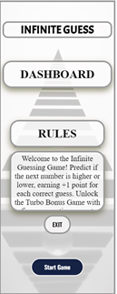
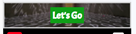
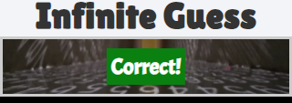
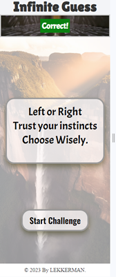
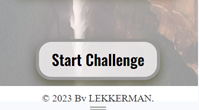

# Infinite Guess - Guessing Number Game

Welcome to **Infinite Guess**, a thrilling guessing number game where your intuition and strategy will be put to the test. Can you accurately predict whether the next number in the sequence is higher or lower? Let the challenge begin!

### Getting Started

To start playing Infinite Guess, simply click on the "Start Game" button and let the guessing game thrill begin!

### Bonus Games

- The Challenge Game is randomized, offering exciting and unexpected challenges.
- The Turbo Bonus Game is triggered when the player achieves five correct answers in a row.
- After 10 attempts, a Mystery Number challenge will be triggered, adding an element of surprise to your gameplay.

### Saving High Scores

- Only the highest score will be saved on the leaderboard.

## Features:

### Welcome Screen and Dashboard:

- **Welcome to Infinite Guess!**
  - Access the welcome screen with a dashboard at the beginning of the game.
  - Explore various options, including checking your high score and reading the game rules.

- **Check Your High Score:**
  - Click on the high scores icon to view your best score.
  - Compete with yourself and aim to beat your own records.
  
  

- **Learn the Rules:**
  - Click on the rules icon to access detailed game instructions.
  - Understand how the scoring system works and master the art of predicting numbers.
  
  

- **Get Ready to Play:**
  - Press the "Start Game" button to kick off the guessing number challenge.
  
  

### Main Playground:

- **Score Monitoring:**
  - Keep track of your current score on the top of the main playground section.
  - Monitor your progress as you make guesses and face various challenges.
  
  

- **Background Video:**
  - Enjoy an immersive gaming experience with a dynamic video background that sets the tone for the game.
  
  

- **Answer Text:**
  - The answer text is prominently displayed, providing feedback on the correctness of your guess.
  - When your guess is correct, the answer text turns green for visual confirmation.
  - If your guess is incorrect, the answer text turns red to indicate a wrong prediction.

  

### Guessing Number

- The central element of the game screen displaying the current number in the sequence.
- You'll use this number as a reference to decide whether the next number will be higher or lower.
- Number is in motion.

 

- **Mystery Number:** After ten attempts, a question mark will be displayed above the guessing number, covering it completely.
  - Upon triggering this feature,pecial message will be displayed with instructions on how to proceed. Pay attention to the guidance provided to enhance your gaming experience.
  -After you guessed it will be displayed another message with value of the Mystery number.

 

### Challenge Screen Features:

- **First Challenge: Double or Nothing:**
  - When triggered, the first opens challenge screen 
   with instructions abot challenge game."

 

- **Start Challenge Button:**
  - A button is provided under the challenge title, inviting players to start the Double or Nothing challenge.
  - Initiating the challenge adds an extra layer of excitement and potential rewards to the gameplay.
 
  ### Challenge Acceptance Screen Features:

- **Challenge Confirmation:**
  - Upon triggering a challenge, the challenge acceptance screen appears.
  - Information about the challenge, including rules and potential rewards for a correct answer, is displayed.

- **Challenge Invitation:**
  - Players receive an invitation to accept or decline the challenge.
  - The invitation includes details about the potential benefits of participating in the challenge.

- **Rules Overview:**
  - In-depth rules about the challenge are provided for players to review before making a decision.
  - Understanding the challenge rules enhances player engagement and strategy.

- **Reward Information:**
  - Details about the potential reward for providing a correct answer are presented
  same as waring what will happen if answer is wrong.
  - Players can assess the risk and reward before deciding to accept or decline the challenge.

- **Accept and Decline Buttons:**
  - Two buttons, "Accept" and "Decline," are displayed at the bottom of the screen.
  - Players can choose to accept the challenge and proceed or decline and continue with regular gameplay.

### Challenge Features:

- **Hidden Numbers Challenge:**
  - In a special challenge round, two numbers are hidden behind "cards."
  - The hidden numbers blink, creating anticipation and excitement for the player.

- **Visual Cues:**
  - The hidden numbers are revealed when clicked, each with a distinct visual effect.
  - Correct answers are highlighted with a green background, providing instant feedback.
  - Incorrect answers trigger a red background, signaling a wrong guess.

- **Intense Music:**
  - The challenge is accompanied by intense music and sounds### Challenge Result Screen Features:

- **Challenge Result Screen:**
  - After completing the Hidden Numbers Challenge, a result screen is triggered.
  - The result screen displays a title and informative text based on whether the player's answer is correct or incorrect.

- **Informative Text:**
  - If the player's answer is correct, the screen provides positive feedback, acknowledging their success.
  - If the player's answer is incorrect, the screen offers guidance or encouragement for the next attempt.

- **OK Button:**
  - An "OK" button is available to close the challenge result screen.
  - Players can proceed to continue their gameplay after reviewing the results.
, enhancing the suspenseful atmosphere.
  - The audio experience intensifies the gaming sensation during the challenge.

### Bonus Round Features:

- **Bonus Round Activation:**
  - Upon successfully guessing five numbers in a row, the Bonus Round is triggered.
  - Players are rewarded with the opportunity to participate in a special bonus challenge.

- **Welcome to Bonus Screen:**
  - The Bonus Round begins with the "Welcome to Bonus" screen.
  - This screen includes a welcome note, rules, and options to start the bonus challenge.

- **Rules Overview:**
  - Players can review specific rules related to the bonus challenge.
  - Understanding the rules enhances the player's chances of success in the bonus round.

- **Start Bonus Button:**
  - A "Start Bonus" button is prominently displayed, inviting players to begin the bonus challenge.
  - Clicking this button initiates the bonus round and presents additional gameplay.

- **Tense Music:**
  - Throughout the bonus round, intense and suspenseful music plays in the background.
  - The music heightens the excitement and adds a dramatic touch to the bonus challenge.

- **Countdown Timer:**
  - A countdown timer is activated during the bonus round, indicating the remaining time, 20 seconds.
  - Players must make their guesses within the given time frame for added intensity.

- **Blinking Numbers:**
  - In the last ten seconds of the bonus round, the guessing numbers blink in red, creating urgency.
  - The visual cue signals the final moments of the bonus challenge.

  
### Turbo bonus Result Screen Features:

- **Turbo bonus Result Screen:**
  - After completing the Bonus Round, players are presented with a dedicated result screen.
  - The result screen features a title, indicating the total points earned during the bonus round.

- **Points Earned:**
  - The score screen clearly displays the points accumulated by the player during the bonus round.
  - Points are based on the player's performance and successful guesses within the given time.

  - **Timer:**
  - When the Turbo Bonus Game is initiated, a timer will appear and countdown from 20 seconds to 0.
  - The timer will blink in red during the last 10 seconds, adding an extra layer of intensity to the game.

- **Exit Button:**
  - A prominent "Exit" button is available on the result screen.
  - Players can choose to exit the bonus result screen and return to the main gameplay.

  - **Correct Answer:**
  - During the Turbo Bonus Game,a correct answer will earn you an additional 2 points for the Mystery Number will be awarded with 10 points.

- **Incorrect Answer:**
  - If the guess for the Turbo Bonus is incorrect, 2 points will be deducted, same if is Mystery Number.

  - **Music and Alert Tone (Turbo Bonus):**
  - Extra pressure is added during the last 10 seconds of the Turbo Bonus Game.
  - Experience heightened tension with a specific alert tone.
  - The red light will blink on the number and timer, creating a thrilling atmosphere.

### Footer:

- The footer displays essential information about the game, including the copyright notice.
- Stay informed about the game's ownership and creation.

