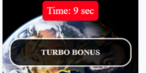
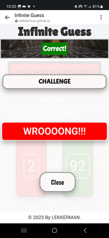
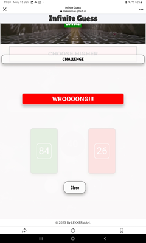

# Infinite Guess - Guessing Number Game

Welcome to **Infinite Guess**, a thrilling guessing number game where your intuition and strategy will be put to the test. Can you accurately predict whether the next number in the sequence is higher or lower? Let the challenge begin!

# Table of Contents

1. [Introduction](#infinite-guess---guessing-number-game)
   1. [Start Game](#start-game)
   2. [Bonus Games](#bonus-games)
   3. [Saving High Scores](#saving-high-scores)
2. [Goals](#goals)
   1. [Owner's Goals](#owners-goals)
   2. [External User Goals](#external-user-goals)
3. [Features](#features)
   1. [Welcome Screen and Dashboard](#welcome-screen-and-dashboard)
      1. [Welcome to Infinite Guess!](#welcome-to-infinite-guess)
      2. [Check Your High Score](#check-your-high-score)
      3. [Learn the Rules](#learn-the-rules)
      4. [Start to Play](#start-to-play)
   2. [Main Playground](#main-playground)
      1. [Score Monitoring](#score-monitoring)
      2. [Background Video](#background-video)
      3. [Exit Button](#exit-button)
      4. [Answer Text](#answer-text)
   3. [Guessing Number](#guessing-number)
      1. [Mystery Number](#mystery-number)
   4. [Challenge Acceptance Screen Features](#challenge-acceptance-screen-features)
      1. [Challenge Confirmation](#challenge-confirmation)
      2. [Challenge Invitation](#challenge-invitation)
      3. [Reward Information](#reward-information)
      4. [Accept and Decline Buttons](#accept-and-decline-buttons)
   5. [Challenge Features](#challenge-features)
      1. [Hidden Numbers Challenge](#hidden-numbers-challenge)
      2. [Visual Cues](#visual-cues)
      3. [Intense Music](#intense-music)
   6. [Challenge Result Screen Features](#challenge-result-screen-features)
      1. [Challenge Result Screen](#challenge-result-screen)
      2. [Informative Text](#informative-text)
      3. [OK Button](#ok-button)
   7. [Bonus Round Features](#bonus-round-features)
      1. [Bonus Round Activation](#bonus-round-activation)
      2. [Welcome to Bonus Screen](#welcome-to-bonus-screen)
      3. [Rules Overview](#rules-overview)
      4. [Start Bonus Button](#start-bonus-button)
      5. [Tense Music](#tense-music)
      6. [Blinking Numbers](#blinking-numbers)
   8. [Turbo bonus Result Screen Features](#turbo-bonus-result-screen-features)
      1. [Turbo bonus Result Screen](#turbo-bonus-result-screen)
      2. [Points Earned](#points-earned)
      3. [Timer](#timer)
      4. [Correct Answer](#correct-answer)
      5. [Incorrect Answer](#incorrect-answer)
      6. [Music and Alert Tone (Turbo Bonus)](#music-and-alert-tone-turbo-bonus)
   9. [Customizable Themes](#customizable-themes)
   10. [Footer](#footer)
4. [Future Features](#future-features)
   1. [Adaptive Difficulty System](#adaptive-difficulty-system)
   2. [Manual Difficulty Selection](#manual-difficulty-selection)
      1. [How it Works](#how-it-works)
   3. [Mission-Based Progression](#mission-based-progression)
   4. [Global Competition](#global-competition)
   5. [Weekly and Monthly Challenges](#weekly-and-monthly-challenges)
   6. [Rewards for Top Performers](#rewards-for-top-performers)
   7. [Friend Leaderboards](#friend-leaderboards)
   8. [Social Integration](#social-integration)
5. [Color Palette](#color-palette)
   1. [Background Colors](#background-colors)
   2. [Text Colors](#text-colors)
   3. [Box Shadows](#box-shadows)
   4. [Outlines](#outlines)
   5. [Buttons](#buttons)
   6. [Project Technologies](#project-technologies)
6. [Testing](#testing)
   1. [Device Testing](#device-testing)
      1. [Samsung Galaxy S21](#1-samsung-galaxy-s21)
      2. [Huawei Nova 8i](#2-huawei-nova-8i)
      3. [Samsung Tablet SM-500](#3-samsung-tablet-sm-500)
      4. [Large Desktop Monitor](#4-large-desktop-monitor)
   2. [Performance Testing](#performance-testing)
   3. [Browser Testing](#browser-testing)
   4. [Validation Status](#validation-status)
      1. [CSS Validation](#css-validation)
      2. [HTML Validation](#html-validation)
      3. [JavaScript Validation](#javascript-validation)
7. [Deployment](#deployment)
   1. [Create a GitHub Repository](#create-a-github-repository)
   2. [Push Code to GitHub](#push-code-to-github)
      1. [Enable GitHub Pages](#enable-github-pages)
   3. [Access Deployed Page](#access-deployed-page)
   4. [Development](#development)
      1. [GitHub Repository](#github-repository)
      2. [Installation](#installation)
         1. [Cloning Infinite Guess Repository in Visual Studio](#cloning-infinite-guess-repository-in-visual-studio)
         2. [Cloning with Terminal or Command Prompt](#cloning-with-terminal-or-command-prompt)
8. [Credits](#credits)
   1. [Credits for Theme Background Images](#credits-for-theme-background-images)
   2. [Credits for Body Background Image](#credits-for-body-background-image)
   3. [Credits for Favicon Icon](#credits-for-favicon-icon)
   4. [Audio Credits](#audio-credits)
      1. [Main Music](#main-music)
      2. [Background Music](#background-music)
      3. [Sounds](#sounds)

## Start game

To start playing Infinite Guess, simply click on the "Start Game" button and let the guessing game thrill begin!

## Bonus Games

- The Challenge Game is randomized, offering exciting and unexpected challenges.
- The Turbo Bonus Game is triggered when the player achieves five correct answers in a row.
- After 10 attempts, a Mystery Number challenge will be triggered, adding an element of surprise to your gameplay.

## Saving High Scores

- Only the highest score will be saved on the leaderboard.

# Goals

## Owner's Goals:

- Create an engaging and immersive guessing number game experience.
- Encourage user retention through exciting bonus features like Turbo Bonus and Mystery Number challenges.
- Provide customization options such as sound and theme settings to enhance user experience.

## External User Goals:

- Enjoy a dynamic and challenging guessing number game with intuitive controls.
- Experience additional excitement through bonus features like Turbo Bonus and Mystery Number challenges.

# Features:

## Welcome Screen and Dashboard:

- **Welcome to Infinite Guess!**
  - Access the welcome screen with a dashboard at the beginning of the game.
  - Explore various options, including checking your high score and reading the game rules.
  
  

- **Check Your High Score:**
  - Click on the high scores icon to view your best score.
  - Compete with yourself and aim to beat your own records.
  
  

- **Learn the Rules:**
  - Click on the rules icon to access detailed game instructions.
  - Understand how the scoring system works and master the art of predicting numbers.
  
  

- **Start to Play:**
  - Press the "Start Game" button to kick off the guessing number challenge.

## Main Playground:

- **Score Monitoring:**
  - Keep track of your current score on the top of the main playground section.
  - Monitor your progress as you make guesses and face various challenges.
  
  

- **Background Video:**
  - Enjoy an immersive gaming experience with a dynamic video background that sets the tone for the game.
  
    

- **Exit Button:**
  - A prominent "Exit" button is available on the result screen.
  - Players can choose to exit and or to save a game.

  

- **Answer Text:**
  - The answer text is prominently displayed, providing feedback on the correctness of your guess.
  - When your guess is correct, the answer text turns green for visual confirmation.
  - If your guess is incorrect, the answer text turns red to indicate a wrong prediction.

  

## Guessing Number

- The central element of the game screen displaying the current number in the sequence.
- You'll use this number as a reference to decide whether the next number will be higher or lower.
- Number is in motion.

 

- **Mystery Number:** After ten attempts, a question mark will be displayed above the guessing number, covering it completely.
  - Upon triggering this feature, a special message will be displayed with instructions on how to proceed. Pay attention to the guidance provided to enhance your gaming experience.
  - After you guessed it will be displayed another message with the value of the Mystery number.

 

## Challenge Acceptance Screen Features:

- **Challenge Confirmation:**
  - Upon triggering the challenge, the challenge acceptance screen appears.
  - Information about the challenge, including rules and potential rewards for a correct answer, is displayed.

  

- **Challenge Invitation:**
  - Players receive an invitation to accept or decline the challenge.
  - The invitation includes details about the potential benefits of participating in the challenge.

- **Reward Information:**
  - Details about the potential reward for providing a correct answer are presented same as warning what will happen if the answer is wrong.
  - Players can assess the risk and reward before deciding to accept or decline the challenge.

- **Accept and Decline Buttons:**
  - Two buttons, "Accept" and "Decline," are displayed at the bottom of the screen.
  - Players can choose to accept the challenge and proceed or decline and continue with regular gameplay.

## Challenge Features:

- **Hidden Numbers Challenge:**
  - In a special challenge round, two numbers are hidden behind "cards."
  - The hidden numbers blink, creating anticipation and excitement for the player.

 
 
- **Visual Cues:**
  - The hidden numbers are revealed when clicked, each with a distinct visual effect.
  - Correct answers are highlighted with a green background, providing instant feedback.
  - Incorrect answers trigger a red background, signaling a wrong guess.

- **Intense Music:**
  - The challenge is accompanied by intense music and sounds.

## Challenge Result Screen Features:

- **Challenge Result Screen:**
  - After completing the Hidden Numbers Challenge, a result screen is triggered.
  - The result screen dynamically changes background colors based on the player's performance.

- **Informative Text:**
  - If the player's answer is correct, the screen provides positive feedback, acknowledging their success.
  - If the player's answer is incorrect, the screen offers guidance or encouragement for the next attempt.

  

- **OK Button:**
  - An "OK" button is available to close the challenge result screen.
  - Players can proceed to continue their gameplay after reviewing the results, enhancing the suspenseful atmosphere.
  - The audio experience intensifies the gaming sensation during the challenge.

## Bonus Round Features:

- **Bonus Round Activation:**
  - Upon successfully guessing five numbers in a row, the Bonus Round is triggered.
  - Players are rewarded with the opportunity to participate in a special bonus challenge.

- **Welcome to Bonus Screen:**
  - The Bonus Round begins with the "Welcome to Bonus" screen.
  - This screen includes a welcome note, rules, and options to start the bonus challenge.

   

- **Rules Overview:**
  - Players can review specific rules related to the bonus challenge.
  - Understanding the rules enhances the player's chances of success in the bonus round.

- **Start Bonus Button:**
  - A "Start Bonus" button is prominently displayed, inviting players to begin the bonus challenge.
  - Clicking this button initiates the bonus round and presents additional gameplay.

- **Tense Music:**
  - Throughout the bonus round, intense and suspenseful music plays in the background.
  - The music heightens the excitement and adds a dramatic touch to the bonus challenge.

- **Blinking Numbers:**
  - In the last ten seconds of the bonus round, the guessing numbers blink in red, creating urgency.
  - The visual cue signals the final moments of the bonus challenge.

## Turbo bonus Result Screen Features:
 
   

- **Turbo bonus Result Screen:**
  - After completing the Bonus Round, players are presented with a dedicated result screen.
  - The result screen features a title, indicating the total points earned during the bonus round.

- **Points Earned:**
  - The score screen clearly displays the points accumulated by the player during the bonus round.
  - Points are based on the player's performance and successful guesses within the given time.

  - **Timer:**
  - When the Turbo Bonus Game is initiated, a timer will appear and countdown from 20 seconds to 0.
  - The timer will blink in red during the last 10 seconds, adding an extra layer of intensity to the game.

    

  - **Correct Answer:**
  - During the Turbo Bonus Game, a correct answer will earn you an additional 2 points, and for the Mystery Number, you will be awarded 10 points.

- **Incorrect Answer:**
  - If the guess for the Turbo Bonus is incorrect, 2 points will be deducted, same as if it is the Mystery Number.

  - **Music and Alert Tone (Turbo Bonus):**
  - Extra pressure is added during the last 10 seconds of the Turbo Bonus Game.
  - Experience heightened tension with a specific alert tone.
  - The red light will blink on the number and timer, creating a thrilling atmosphere.

- **Customizable Themes:**
  - Allow users to personalize their gaming experience with customizable themes.
  - Choose from a variety of color schemes, backgrounds, and visual elements to tailor the game's look.

## Footer:

   

- The footer displays essential information about the game, including the copyright notice.
- Stay informed about the game's ownership and creation.

# Future Features:

- **Adaptive Difficulty System:**
  - Introduce a dynamic difficulty system that automatically adjusts based on the player's performance. As players progress and demonstrate mastery, the game dynamically increases the challenge to maintain engagement and excitement.

- **Manual Difficulty Selection:**
  - Empower players with the ability to manually choose their preferred difficulty level.
  - Whether you're a beginner seeking a relaxed experience or a seasoned player craving a more intense challenge, customize the game according to individual preferences.

  - **How it Works:**
    - The adaptive difficulty system ensures a seamless transition between manual and dynamic difficulty modes.
    - Players can switch between manual and adaptive modes at any time, allowing for a flexible and personalized gaming experience.

- **Mission-Based Progression:**
  - Implement a mission-based progression system, offering players a structured way to advance through the game.
  - Completing missions unlocks new features, challenges, or customization options, providing a sense of accomplishment.

- **Global Competition:**
  - Introduce a Global Highscore System that allows players to compete on a worldwide leaderboard.
  - Players can see how their skills measure up against participants from various regions, adding a competitive and global aspect to the game.

- **Weekly and Monthly Challenges:**
  - Implement weekly and monthly challenges within the Global Highscore System.
  - Players can strive to achieve top rankings in specially curated challenges, each with unique objectives and rewards.

- **Rewards for Top Performers:**
  - Recognize and reward top-performing players on the global leaderboard.
  - Exclusive in-game rewards, badges, or other virtual incentives can be granted to those who consistently excel and secure top positions.

- **Friend Leaderboards:**
  - Extend the competition to friends by incorporating Friend Leaderboards.
  - Challenge your friends directly and compare your scores within a more intimate and personalized leaderboard.

- **Social Integration:**
  - Allow players to share their high scores and achievements on social media platforms.
  - Foster a sense of community and friendly competition by encouraging players to showcase their accomplishments to a wider audience.

# Color Palette

## Background Colors

- **Primary Background Color:** `rgba(253, 251, 251, 0.8)`
- **Secondary Background Color:** `rgba(253, 251, 251, 0.7)`

## Text Colors

- **Primary Text Color:** `black`
- **Secondary Text Color:** `rgb(128, 128, 128)`

## Box Shadows

- **Box Shadow Color:** `rgba(5, 0, 0, 0.3)`

## Outlines

- **Outline Color:** `rgb(155, 154, 154)`

## Buttons

- **Button Text Color:** `black`
- **Button Background Color:** `rgba(253, 251, 251, 0.8)`
- **Button Box Shadow:** `0 8px 1rem rgba(5, 0, 0, 0.3)`
- **Button Border Color:** `rgb(155, 154, 154)`
- **Exit Button:** `red`

## Project Technologies

- **Development Tools**
  - Visual Studio (VS)
  - Git
  - GitHub

- **Artificial Intelligence**
  - ChatGPT

- **Design and Graphics**
  - Adobe Photoshop
  - Windows Paint
  - Ableton

- **Web Technologies**
  - HTML
  - CSS
  - JavaScript

# Testing

## Device Testing

The Infinite Guess game has been tested on various devices to ensure a seamless gaming experience. Here are the test results for specific devices:

### 1. Samsung Galaxy S21

- **Browser:** Tested and optimized for the latest versions of Google Chrome and Samsung Internet Browser.
- **Screen Resolution:** Ensured responsive design for the display resolution of Samsung Galaxy S21 (e.g., 1080 x 2400 pixels).
- **Touch Controls:** Verified smooth and accurate touch controls for intuitive gameplay.

 

### 2. Huawei Nova 8i

- **Browser:** Tested and optimized for the latest versions of Google Chrome and Huawei Browser.
- **Screen Resolution:** Ensured responsive design for the display resolution of Huawei Nova 8i.
- **Touch Controls:** Verified smooth and accurate touch controls for intuitive gameplay.

 

### 3. Samsung Tablet SM-500

- **Browser:** Tested and optimized for the latest versions of Google Chrome and Samsung Internet Browser.
- **Screen Resolution:** Ensured responsive design for tablet-sized displays (e.g., 1200 x 1920 pixels).
- **Touch Controls:** Verified smooth and accurate touch controls for intuitive gameplay.

   

### 4. Large Desktop Monitor

- **Browser:** Tested and optimized for the latest versions of Google Chrome, Mozilla Firefox.

- **Screen Resolution:** Ensured responsive design for large desktop monitors (e.g., 1920 x 1080 pixels or higher).

 

## Performance Testing

Performance testing has been conducted to ensure a smooth and enjoyable gaming experience across devices. The game's resource usage and loading times have been optimized for efficient performance on various platforms.

## Browser Testing

The Infinite Guess game has been tested on major web browsers, including:

- **Browser:** Tested and optimized for the latest version of Google Chrome.

- **Browser:** Tested and optimized for the latest version of Mozilla Firefox.

Feel free to provide feedback if you encounter any issues on the mentioned devices. 

## Validation Status

Ensuring the correctness and compliance of code is crucial for a seamless user experience. Below are the validation results for the Infinite Guess project:

### CSS Validation

The CSS code has been validated using the W3C CSS Validator. Click on the link below to view the detailed validation report.

[CSS Validator](https://jigsaw.w3.org/css-validator/validator?uri=https%3A%2F%2Fnlekkerman.github.io%2Finfinite-guess%2F&profile=css3svg&usermedium=all&warning=1&vextwarning=&lang=en)

### HTML Validation

The HTML code has been validated using the W3C HTML Validator. Explore the link to see the detailed validation report.

[HTML Validator](https://validator.w3.org/nu/?doc=https%3A%2F%2Fnlekkerman.github.io%2Finfinite-guess%2F)

#### 404 HTML Validation

### JavaScript Validation

The JavaScript code has been checked for potential issues using JSHint. Click on the link to review the validation results.

[JavaScript Validator](https://jshint.com/)

# Deployment

## Create a GitHub Repository:

1. Created a new repo on GitHub from the Code Institute template [Code Institute Template](https://github.com/Code-Institute-Org/gitpod-full-template)

## Push Code to GitHub:

1. Initialized a Git repository locally.
2. Added and committed HTML, CSS, and other relevant files.
3. Pushed the code to the GitHub repository.

### Enable GitHub Pages:

1. Went to the GitHub repository on the GitHub website.
2. Clicked on the "Settings" tab.
3. Scrolled down to the "GitHub Pages" section.
4. Under "Source," selected the branch `main` for GitHub Pages.

## Access Deployed Page:

The deployed page for Infinite Guess is accessible [here](https://nlekkerman.github.io/infinite-guess/).

## Development

### GitHub Repository

The source code for Infinite Guess is on GitHub. You can find the repository at:

[Infinite Guess Repository](https://github.com/nlekkerman/infinite-guess)

Feel free to explore the codebase, open issues, and submit pull requests.

## Installation

### Cloning Infinite Guess Repository in Visual Studio

Follow these steps to clone the Infinite Guess repository using Visual Studio:

1. Open Visual Studio: On the start window, select "Clone a repository."
2. Enter Repository URL: In the "Clone a Repository" window, enter the repository URL: `https://github.com/nlekkerman/infinite-guess.git`
3. Choose Local Directory: Choose a directory on your local machine where you want to clone the repository.
4. Click "Clone": Click the "Clone" button.
5. Open Cloned Project: Once the cloning process is complete, open the cloned project in Visual Studio.

Now you have the Infinite Guess project cloned to your local machine, and you can explore, modify, and run it from within Visual Studio.

### Cloning with Terminal or Command Prompt

1. Open a terminal or command prompt. Navigate to Local Directory: cd path/to/your/directory
2. Clone Repository: Run the following command to clone the Infinite Guess repository from GitHub: `git clone https://github.com/nlekkerman/infinite-guess.git`
3. Navigate to Cloned Project: `cd infinite-guess`

Now you have the Infinite Guess project cloned to your local machine, and you can explore, modify, and run it from the terminal.

# Credits 

### Credits for Theme Background Images:

- **Welcome Screen Background:**
  - [Welcome Screen Background:](https://www.freepik.com/free-ai-image/3d-rendering-abstract-black-white_72619051.htm#fromView=search&term=black+and+qhiute+hiorzontal+line+sphere&track=ais_ai_generated&regularType=ai&page=1&position=24&uuid=3849b9a6-090f-49f0-a904-62c3ec5ea5a1)

- **Default Theme Background:**
  - [Welcome Screen Background:](https://www.freepik.com/free-photo/3d-rendering-optical-illusion_71555831.htm#query=black%20and%20whiute%20ilusion%20horizontal%20lines&position=15&from_view=search&track=ais&uuid=5e247c8b-a254-4ae0-b655-45a6e514962c")

- **Earth Theme Background:**
  - [Earth Theme Image by freepik](https://www.freepik.com/free-ai-image/earth-seen-from-space_47990964.htm#fromView=search&term=earth&track=ais_ai_generated&regularType=ai&page=1&position=46&uuid=5e18fb99-9b69-4e76-899c-dfe7275bf4ab)

- **Space Theme Background:**
  - [Space Theme Image by freepik](https://www.freepik.com/free-ai-image/photorealistic-galaxy-background_94939196.htm#fromView=search&term=space&track=ais_ai_generated&regularType=ai&page=1&position=34&uuid=6b49735f-a54f-4d1b-9a31-4aba7c43dd21)

- **Fairy Theme Background:**
  - [Fairy Theme Image by freepik](https://www.freepik.com/free-ai-image/beautiful-medieval-fantasy-landscape_77379795.htm#fromView=search&term=fairy+mushrooms&track=ais_ai_generated&regularType=ai&page=3&position=30&uuid=10c82b9b-5a13-4bde-a127-adccc2fdb916)

  ### Credits for Body Background Image:

- **Body Background:**
  - [Body background Image by freepik](https://www.freepik.com/free-ai-image/3d-rendering-abstract-black-white-background_75957971.htm#fromView=search&term=infinite&track=ais_ai_generated&regularType=ai&page=5&position=22&uuid=00297804-a0fe-4b40-b53b-c56fec93f20d)

- **404 image:**
  - [Image by freepik](https://www.freepik.com/free-vector/oops-404-error-with-broken-robot-concept-illustration_13315300.htm#query=404%20error%20page%20not%20found%20check%20you%20connection&position=1&from_view=search&track=ais&uuid=13aa07e9-54b4-4f59-9202-678dbc1f37b1)

### Credits for Favicon Icon:

- **Favicon Icon:**
  - [Icon by freepik](https://www.freepik.com/icon/internet-computer_7505387#fromView=search&term=favicon+for+infinite&track=ais&page=1&position=95&uuid=d4902875-4138-447a-aed5-7c3a02d8a4ab)

  ### Credits for 404 page:

# Audio Credits:

#### Main Music:

- Original music track Nice Touch by Lekkerman.

#### Background Music:

- **Turbo Bonus Music:**
  - [Turbo Bonus Music](https://freesound.org/people/Victor_Natas/sounds/634513/) by Victor_Natas from freesound.org
- **Challenge Music:**

- [Challenge Music](https://freesound.org/people/Ezcah/sounds/245421/) by Ezcah from freesound.org

#### Sounds:

- **Mystery Number Sound:**
  - [Mystery Number sound](https://freesound.org/people/ertfelda/sounds/243701/) by ertfelda from freesound.org

- **Correct Answer Sound :**
  - [Correct Answer sound](https://freesound.org/people/ertfelda/sounds/243701/) by ertfelda from freesound.org

- **Wrong Answer Sound:**
  - [Wrong Answer sound](https://freesound.org/people/Beetlemuse/sounds/587253/) by Beetlemuse from freesound.org

  
- **Correct Answer Challenge Sound:**
  - [Correct Answer Challenge sound](https://freesound.org/people/tim.kahn/sounds/337000/) by tim.kahn from freesound.org

  
- **Wrong Answer Challenge Sound:**
  - [Wrong Answer Challenge sound](https://freesound.org/people/dr_skitz/sounds/353925/) by dr_skitz from freesound.org

  
- **Timer Alarm Sound:**
  - [Timer Alarm Sound](https://freesound.org/people/MATRIXXX_/sounds/523212/) by MATRIXXX_ from freesound.org

- **Button Click Sound:**
  - [Button Click Sound](https://freesound.org/people/MATRIXXX_/sounds/523762/) by MATRIXXX_ from freesound.org

## Acknowledgements

- I would like to express my gratitude to [ChatGPT](https://openai.com/) for its valuable assistance in enhancing the workflow of this game. ChatGPT has been instrumental in providing guidance and improving the clarity and organization of the document.
- Feel free to reach out to [ChatGPT](https://openai.com/) for any language model assistance in your projects.

- Special thanks to my mentor mr Brian O'Hare and my classmates and slack community for help.
